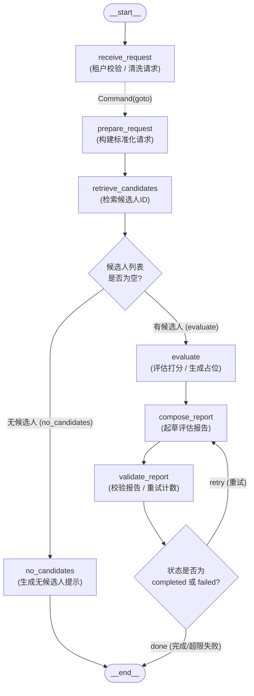

# 第 11 课：LangGraph 状态模型与人才决策主图——完整学习与课后作业指导

> 代码依据：2026-09-26 的本地工作树 `backend/app/talent_decision_graph.py`、验证脚本和测试；该工作树可能已含你的练习修改，所以本文会把“当前实际运行结果”与“作业参考改法”分开说。命令从 `D:\Code\K_Course\talent-eval-agents_learning\backend` 执行。本课图尚无 HTTP 接口；先理解图内协议，再讨论未来接入。

## 0. 先回答：这节课比“一个 State 顺着图走”多了什么？

你以前做的最简 LangGraph 并没有错：**每个节点读同一份 State、返回局部更新，边决定下一站**，本课依然是这个模型。复杂感来自真实业务增加的四件事：① State 有多种字段，更新方式不能都一样；② 外部输入、内部过程和最终输出不是同一张表；③ 租户/权限属于可信调用上下文，不应混在用户可写 State 中；④ 图不再只有一条直线，而有空候选分支和失败重试环。**不是“四个 State 在图里轮流传”，而是同一个内部 State 合并各节点写入的增量**，外加一个不由节点增量更新的 Runtime Context。

本课的核心任务是：先设计可扩展的 **State Contract（节点间数据协议）**，再把人才决策拆成可观察、可分支、可终止的节点。候选人检索、评估、报告目前是课堂占位实现；真正的 LLM、工具、Subagent、人机交互尚未接入。不要把“图的骨架已能走通”误认为“完整人才决策业务已上线”。

### 0.1 老师的六条回顾，在本项目里分别落在哪里

| 课件回顾 | 你要理解的因果关系 | 代码锚点 |
|---|---|---|
| State 保存跨节点共享快照，节点只返回局部更新 | 下一节点能读之前的字段；返回值不是替换整个 State | `TalentDecisionState`；`_prepare_request` 只返回 `request/status` |
| 消息、业务状态、运行状态分开 | 对话记录、业务产物、路由/错误不能挤在一个 `messages` 文本里 | `messages`、`candidate_ids/evaluations`、`status/errors/retry_count` |
| 租户和权限由 Runtime Context 注入 | 用户需求不能自行声明自己属于哪个租户；检索依赖调用级身份 | `DecisionContext`；`Runtime[DecisionContext]`；`context_schema=` |
| 普通字段覆盖，并行聚合字段定义 Reducer | “当前报告”与“累计评估/引用”语义不同；并行同时写普通字段会冲突 | `status/report`；`Annotated[..., add_messages/list.__add__/merge_evidence_refs]`；并行对照图 |
| 普通边、条件边和 Command 负责不同控制流 | 固定下一步、根据结果分支、写入后跳转要分别表达 | `add_edge`、`add_conditional_edges`、`_receive_request` 返回 `Command` |
| 正常、空候选和受控重试都有终点 | 不靠隐式 `if` 或无限循环碰运气；每条路径都能解释如何到 END | `_route_candidates`、`_validate_report`、`_route_report`、`_no_candidates` |

**复习时先问自己**：每个字段是谁生产的、后面谁消费、重复/并行写时如何合并、是否应该对外暴露；每条边为什么走这条路、何时结束。能从代码回答这两组问题，就抓住了本课主线。

## 1. 先看实际图：节点、分支、循环和终点

下面的 Mermaid 是对当前 `build_talent_decision_graph()` 的**可读标注图**，可直接在支持 Mermaid 的 Markdown 阅读器中查看。边上的 `_route_*` 是**条件函数名**，不是新注册的节点；虚线说明 `receive_request` 用 `Command.goto` 跳转，而非另加普通固定边。



**读图三遍**：

1. **正常路径**：`START → receive_request → prepare_request → retrieve_candidates → evaluate → compose_report → validate_report → END`。测试中的固定 provider 返回 `C001/C004`，报告非空，状态为 `completed`。
2. **空候选路径**：前三步相同，provider 返回 `[]`，条件边走 `no_candidates → END`，**不执行**评估和报告重试；状态为 `no_candidates`。
3. **始终空报告路径**：必须先有候选，否则根本到不了 `compose_report`。每次空报告后 `validate_report` 增加 `retry_count`；当前上限为**额外重试 1 次**，第二次空报告标记 `failed`，条件边走 END。正常 `_compose_report` 会返回非空字符串，这条路径需要测试用失败注入才能走到。

构图代码把上述关系落实为三种边，而不是在一个巨大节点里写全部 `if/while`：

```python
builder.add_edge(START, "receive_request")
builder.add_edge("prepare_request", "retrieve_candidates")
builder.add_conditional_edges("retrieve_candidates", _route_candidates)
builder.add_edge("evaluate", "compose_report")
builder.add_edge("compose_report", "validate_report")
builder.add_conditional_edges(
    "validate_report", _route_report,
    {"retry": "compose_report", "done": END},
)
builder.add_edge("no_candidates", END)
# receive_request 没有额外的 add_edge；它通过 Command.goto 指向 prepare_request。
```

课堂验证脚本用 `graph.get_graph().draw_mermaid()` 也能打印编译图；上图另外写出了业务含义，避免只看机器生成的节点名称不知为什么分支。

### 1.1 别把第 10 课 HTTP 链和这张图误接起来

已存在的第 10 课入口是 `POST /api/talent-search`（以及引用查询接口），经过 FastAPI、查询计划、租户过滤与证据检索返回 HTTP JSON。本课入口**只是 Python** 的 `graph.invoke(...)` / `graph.stream(...)`；仓库里尚无 `POST /api/talent-decision`。本课调用方传一个 `CandidateProvider`，验证脚本只按文本是否含 `ai` 返回固定候选 ID，不调用前一课的 HTTP 服务、数据库、LLM 或证据包。将来对接时要有显式适配层和真实权限过滤，不能画一条已实现的跨课调用边。

## 2. 沿代码学会 State Contract：数据、写入规则、控制流

### 2.1 与最简图相比：同一个 State，增加了三层边界

最简图常只写 `StateGraph(MyState)`，输入和输出看起来就是整份 State。这里 `TalentDecisionState` 仍是**唯一的内部共享工作区**，但编译图时显式指定输入、输出和 Context：

```python
builder = StateGraph(
    TalentDecisionState,                # 所有节点共享的内部字段/通道
    context_schema=DecisionContext,     # 本次执行可信依赖的类型
    input_schema=TalentDecisionInput,   # 调用者提交的业务输入
    output_schema=TalentDecisionOutput, # invoke 的最终对外投影
)
```

| 协议 | 本项目字段／用途 | 不要误解为 |
|---|---|---|
| `TalentDecisionInput` | `messages`、`request_text`；调用者的任务内容 | 有权传 `tenant_id` 或覆盖内部评估的 API 请求体 |
| `TalentDecisionState` | 上述字段加 `request/candidate_ids/evidence_refs/evaluations/report/status/errors/retry_count`；节点间共享并累积更新 | 每个字段一开始都存在；`total=False` 只说明这些键可以缺省 |
| `TalentDecisionOutput` | `status/candidate_ids/evaluations/report/errors`；结束后返回的可见结果 | 全量内部 State；`retry_count`、Context 不会自动返回 |
| `DecisionContext` | `tenant_id/permission_scopes`；本次运行的调用级依赖 | 模型从用户消息推断的租户；可以通过节点更新改写的 State |

**关键差别**：Input/State/Output 是同一张图的不同**可见边界**，不是三个相继运行的图或三个互相拷贝的对象。`TypedDict` 的类型描述及图 Schema 不等于 Web 层身份校验或对任意输入的完整运行时验证。

**把最简图映射过来**：假设旧练习只用一个 `SimpleState{text}`、两个节点 `A → B`，`A` 返回 `{"text": ...}`，`B` 读更新后的 `text`。本课仍是 `TalentDecisionState` 这**一个共享 State**、节点仍返回局部字典，只是字段多了、某些列表需要 Reducer，并在图的外部加上输入/输出投影和可信 Context。先不要把 `Input/Output/Context` 想象成四条并行传递的 State；每步该读什么由节点函数参数和字段协议明确。画图时节点和边表示**控制流**，State 与 Context 表示流转时携带/读取的数据；两者是不同维度。
### 2.2 四类运行数据：为什么不能一股脑放进 messages

人才决策流程的数据生命周期和可信边界不同。下面沿用课件的四类，但把本项目实际的**读、写、合并**也列出来：

| 类型 | 具体字段 | 谁写／谁读 | 更新特点 |
| :--- | :--- | :--- | :--- |
| **消息** | `messages: Annotated[list[AnyMessage], add_messages]` | 调用方可输入；本课节点尚未消费或生成消息 | 按消息 ID 合并/替换，适合以后接聊天模型、工具消息；不是当前报告或权限的载体。 |
| **业务状态** | `request`、`candidate_ids`、`evidence_refs`、`evaluations`、`report`；作业中的 `request_version` | `prepare_request` 写需求、检索写 ID、评估写结果、报告节点写报告 | 有的是当前值覆盖，有的是列表聚合；字段名和类型让下游明确读什么。 |
| **运行状态** | `status`、`errors`、`retry_count` | 各节点更新状态；`_route_report` 读 `status` | 控制阶段、终止和错误记录；`status/retry_count` 是当前值，`errors` 采用追加 Reducer。 |
| **Runtime Context** | `tenant_id`、`permission_scopes` | 可信调用方构造；需要身份的节点读 `runtime.context` | 不由业务节点的增量写入；本课只检查 tenant 非空，还不是实际权限系统。 |

`messages` 将来可存用户、模型、工具消息并直接传入聊天模型，但**这张图当前没有调用聊天模型**，脚本传入 `HumanMessage` 后也未由节点读取。岗位条件、候选人 ID、证据引用、评估结果用明确字段，才能让业务代码和测试直接读结构化对象，而不是从对话文本反复解析。`evidence_refs` 目前虽在 State 协议里，主图尚无节点真正产出引用；字段存在不代表业务功能已实现。

> **边界提醒**：课件把 `status/errors/retry_count` 放“运行状态”，仍是 **State 内的字段**，并非 `Runtime` 对象。名字相近但不是同一概念：`Runtime` 是执行时注入的对象，`runtime.context` 是另一条可信数据通道。

### 2.3 一次执行到底怎样“流转 State”？拿增量还原过程

节点接收可见 State，返回一个只包含**这次要更新的键**的字典；LangGraph 依字段规则把它合进 State，再把更新后的 State 交给下一节点。用验证脚本的正常输入说明（下面只挑字段展示）：

```text
输入 Input: {messages: [HumanMessage(...)], request_text: "筛选有 AI 项目经验的技术负责人"}
接收节点返回: {request_text: 去空格后文本, status: "received", errors: []}
准备节点返回: {request: {original_text: 同一文本, task_type: "evaluate_and_recommend"}, status: "request_ready"}
检索节点返回: {candidate_ids: ["C001", "C004"], status: "candidates_ready"}
评估节点返回: {evaluations: [{candidate_id: "C001", status: "placeholder"}, ...]}
报告节点返回: {report: "候选人评估占位结果：C001、C004", status: "drafting"}
校验节点返回: {status: "completed"}
最终 Output: {status, candidate_ids, evaluations, report, errors}
```

例如 `_evaluate` 只返回 `evaluations`，并不重写 `request` 和 `candidate_ids`；这两个字段不会凭空消失。`graph.stream(..., stream_mode="updates")` 看到的 `{"evaluate": {"evaluations": [...]}}` 是**本节点增量**，不是“此时 State 只剩 evaluations”。想看整体快照要换成适合的 values 模式。`graph.invoke(...)` 最终只给 Output Schema 中声明的字段，因此调试内部字段优先用 updates，不要为了测试把可信 Context 或重试计数暴露给最终用户。

**本地工作树的一个有价值的排错例子**：当前 `_prepare_request` 的源码还返回 `"request_version": 1`，但 `TalentDecisionState` 没有声明 `request_version`。本次运行的 `prepare_request` updates 实际只出现 `request/status`，说明“节点返回了键”不等于“图已登记并传播该字段”。作业 1 必须同时改 State Contract 和节点返回；以后修改字段先检查声明，再观察 updates。若你后来已补上声明，重新运行时应看到 `request_version` 出现在该节点增量。

**把节点代码与图对起来看**（以下为当前图的关键函数节选；`_prepare_request` 返回的版本号在本地 State 尚未声明，见上面的排错提示）：

```python
def _prepare_request(state: TalentDecisionState) -> dict:
    return {
        "request": {
            "original_text": state["request_text"],
            "task_type": "evaluate_and_recommend",
        },
        "request_version": 1,
        "status": "request_ready",
    }


def _candidate_node(candidate_provider: CandidateProvider):
    def retrieve_candidates(
        state: TalentDecisionState, runtime: Runtime[DecisionContext],
    ) -> dict:
        ids = candidate_provider(state["request"], runtime.context)
        return {"candidate_ids": ids, "status": "candidates_ready"}
    return retrieve_candidates


def _evaluate(state: TalentDecisionState) -> dict:
    return {"evaluations": [
        {"candidate_id": cid, "status": "placeholder"}
        for cid in state["candidate_ids"]
    ]}


def _compose_report(state: TalentDecisionState) -> dict:
    ids = "、".join(item["candidate_id"] for item in state["evaluations"])
    return {"report": f"候选人评估占位结果：{ids}", "status": "drafting"}


def _no_candidates(_: TalentDecisionState) -> dict:
    return {
        "evaluations": [], "report": "当前条件下未检索到候选人。",
        "status": "no_candidates",
    }
```

这里为了突出输入/输出字段，把局部变量 `candidate_ids/candidate_text` 在示意片段里缩写成 `ids`，逻辑与仓库一致。按**生产者 → 消费者**读：`prepare_request` 生产 `request` → provider 消费 request 生产 `candidate_ids` → `_route_candidates` 先判断是否为空 → `_evaluate` 消费 ID 生产 `evaluations` → `_compose_report` 消费评估生产报告 → `_validate_report` 决定完成/重试。空候选直接走 `_no_candidates`，返回一份人类可读的终点结果而不调用评分与成文。当前 `placeholder` 说明没有真实评估模型；`report` 也只是拼接候选 ID，不是经过证据支撑的正式推荐。

**手推一次 State**：检索节点执行前，State 至少有输入文本和准备好的 `request`；节点仅返回 `{"candidate_ids": ["C001", "C004"], "status": "candidates_ready"}`。合并后下游既看得到原有 `request`，也看得到新 `candidate_ids`；下一节点 `_evaluate` 不需要把 `request` 再抄一遍。相反 `stream_mode="updates"` 只记录节点本次写入的那两个键。这个“节点返回局部差量／图维护共享快照”的区分，是从最简图升级到业务图的第一道坎。
### 2.4 Reducer：为什么普通覆盖在并行和累计场景会出问题

先把每个字段的**业务含义**说清，再选合并函数；不要见列表就无脑 `+`，也不要见并行冲突就给整数加法：

```python
# TalentDecisionState 中的关键声明（节选）
messages: Annotated[list[AnyMessage], add_messages]      # 按消息 ID 合并
candidate_ids: list[str]                                 # 一个当前候选列表：覆盖
evaluations: Annotated[list[EvaluationResult], list.__add__]  # 累计评估
errors: Annotated[list[str], list.__add__]                # 累计错误
evidence_refs: Annotated[list[str], merge_evidence_refs] # 按引用 ID 去重合并
report: str                                               # 当前报告：覆盖
retry_count: int                                          # 当前尝试计数：覆盖
```

没有 `Annotated[..., reducer]` 的字段，同一轮**单个写入**可覆盖旧值；若同一 superstep 的两个并行分支都写这个字段，则普通通道不能随意选一个，会抛 `InvalidUpdateError`。代码里的 `build_missing_reducer_demo()` 让两个分支同时返回 `{"items": ["A"]}` / `{"items": ["B"]}`，就是故意让你看到这个错误；`build_reducer_demo()` 给 `items` 加 `list.__add__`，结果合并成 `A/B`。这两个小图只是**并行更新规则对照实验**，人才决策主图本身没有这两条并行分支。

`list.__add__` 表示连接：`["r1"] + ["r1"]` 仍有两个 `r1`。若证据引用的语义是“同一 ID 只留一次”，作业用 `merge_evidence_refs(left, right)` 去重。相反 `status` 或 `retry_count` 是**当前值**，不能把 `received` 与 `drafting` 拼成列表、也不能让两个分支对计数做没有业务定义的相加。还有一个常见坑：`errors` 是加法 Reducer，节点返回 `{"errors": []}` 是**追加空列表**，不是清空旧错误。选择 Reducer 时要考虑重跑、分支汇合、去重、顺序与是否需要清空。

### 2.5 三种控制流怎么从代码读出来

**固定边**：`builder.add_edge("evaluate", "compose_report")`，评估之后总去生成报告。**条件边**：检索结果决定下一站；路由函数只读 State 并返回目的节点名，不是另一个生产业务字段的节点：

```python
def _route_candidates(state: TalentDecisionState) -> Literal["evaluate", "no_candidates"]:
    return "evaluate" if state.get("candidate_ids") else "no_candidates"
```

**Command**：接收节点既要把去空格的文本及阶段写入，又要立即指定下一站，所以返回 `Command(update=..., goto=...)`：

```python
def _receive_request(
    state: TalentDecisionState, runtime: Runtime[DecisionContext],
) -> Command[Literal["prepare_request"]]:
    if not runtime.context.tenant_id.strip():
        raise ValueError("Runtime Context 中的 tenant_id 不能为空")
    request_text = state["request_text"].strip()
    if not request_text:
        raise ValueError("request_text 不能为空")
    return Command(
        update={"request_text": request_text, "status": "received", "errors": []},
        goto="prepare_request",
    )
```

此节点**不能再额外**接一条 `receive_request → prepare_request` 固定边，否则可能重复调度。`Command` 的泛型 `Literal["prepare_request"]` 描述可能去的目的节点，和 `Runtime[DecisionContext]` 的 Context 类型参数不是一回事。

### 2.6 为什么报告失败不会无限转圈：把次数算清楚

```python
MAX_REPORT_RETRIES = 1  # 最多额外重做一次，不是总生成次数

def _validate_report(state: TalentDecisionState) -> dict:
    if state.get("report"):
        return {"status": "completed"}
    retries = state.get("retry_count", 0) + 1
    if retries > MAX_REPORT_RETRIES:
        return {"retry_count": retries, "status": "failed", "errors": ["报告为空"]}
    return {"retry_count": retries}

def _route_report(state: TalentDecisionState) -> Literal["retry", "done"]:
    if state.get("status") in {"completed", "failed"}:
        return "done"
    return "retry"
```

第一次报告为空：初始计数默认 0，校验写 1，仍处于 `drafting`，条件边返回 `retry`，回到 `compose_report`。第二次仍为空：写 2，`2 > 1`，状态 `failed` 并追加错误，条件边返回 `done`，到 END。若任一次报告非空，则 `completed` 直接结束。`failed` 是**图的业务结果**，不是自动抛 Python 异常或自动转成 HTTP 500。空候选则更早走 `no_candidates`，不会进入这段重试逻辑。你能自己算清“额外重试次数”和“生成总次数”，就理解了有界循环。

### 2.7 Runtime Context：类型参数是什么，为什么这里单独放租户/权限

`runtime: Runtime[DecisionContext]` 中的 `DecisionContext` 是泛型类型参数，表示节点可把 `runtime.context` 按该结构使用；它**不是**新建第二份 State，也不会自动做鉴权。和 `list[str]` 的 `str` 类似，标注帮读代码与类型检查；具体值要由**可信调用方**用 `context=` 提供。图编译声明 `context_schema=DecisionContext`，LangGraph 在执行需要 Runtime 的节点时注入 Runtime。

```python
@dataclass(frozen=True)
class DecisionContext:
    tenant_id: str
    permission_scopes: tuple[str, ...]

CandidateProvider = Callable[[TalentRequest, DecisionContext], list[str]]

# 脚本 main()：示例固定值；生产环境须由认证后的可信入口创建
context = DecisionContext(tenant_id="course-demo", permission_scopes=("hr_private",))
graph = build_talent_decision_graph(_fixture_candidate_provider)
result = graph.invoke(
    {"messages": [], "request_text": "筛选 AI 工程师"}, context=context,
)

# 图节点 retrieve_candidates 内：把需求和可信上下文分开传给 provider
candidate_ids = candidate_provider(state["request"], runtime.context)
```

上面是**分别位于图模块、验证脚本、节点内部的代码摘录**，不是让你把三段接在一个 Python 作用域直接运行。`frozen=True` 和元组防止示例随意改写 Context，但不证明租户身份真实。`_receive_request` 仅检查 `tenant_id` 非空；当前固定 provider 不用 `permission_scopes` 真正过滤数据，**没有完成实际授权**。将来接数据库检索时，在可信入口验证身份，并在实际查询/引用读取处执行租户与权限过滤，不能靠“请求体带了一个 tenant_id”或这一处非空检查假装安全。只读 State 的 `_prepare_request/_evaluate` 不需要声明 Runtime 参数。

### 2.8 你应该如何自己验证、复盘、延伸

| 问题 | 设计选择 | 在项目里怎样验证 |
|---|---|---|
| 节点之间如何知道字段从哪里来？ | State Contract 显式定义字段；生产者返回增量 | 顺着 `_prepare_request → retrieve_candidates → evaluate` 读字段；观察 updates |
| 用户如何避免改写租户？ | Input 与 Context 分离，可信入口构造 Context | `TalentDecisionInput` 无租户字段；空租户测试验证第一节点拒绝，但不等于鉴权完成 |
| 多个分支同时写一字段怎么办？ | 先定业务语义，再选 Reducer 或重排节点 | 对照 `build_missing_reducer_demo/build_reducer_demo` 的异常/合并 |
| 什么情况下结束？ | 条件边显式指向 no_candidates 或 done/END，重试计数设上限 | 正常 6 个更新事件；空候选 4 个；失败注入时报告与校验各执行 2 次 |
| 为什么有 Input/Output 还需要 State？ | 输入不应随便携带内部产物，输出不应泄露中间字段 | 比较 `graph.stream(..., updates)` 与 `graph.invoke(...)` 的键集合 |

命令（从 `backend` 目录）：

```powershell
uv run --offline --locked python -m scripts.verify_talent_decision_graph
uv run --offline --locked python -m pytest -q tests/test_talent_decision_graph.py
```

验证脚本会打印实际编译图的 Mermaid、正常路径的节点更新、空候选输出和并行 Reducer 对照。终端如果出现中文乱码，先修终端编码，不要据此推断 State 文本被图改坏。本地工作树里练习代码可能变化，**复习时先拿当前源码和输出核对本页描述**。

**未来扩展的边界**：State Contract 给工具节点、Subagent、人机确认提供可以接入的字段和节点契约，但这些能力**尚未在本课主图实现**。接入时要为每个新节点说明输入字段、输出增量、并发合并、失败/重试与权限来源；“已经预留协议”不等于“功能已经存在”。

## 3. 四项课后作业：具体修改、测试与调用链

> 建议先在自己的练习分支提交一份原始测试结果，再逐项“写失败测试 → 最小代码变更 → 重跑”。以下是**动手实现指导**，不是“把测试文件抄一遍”：先读现有图和字段，再改对应的生产模块或验证脚本，最后用测试确认语义。代码片段对应当前仓库；文中的“替换”表示只替换指定函数或循环，不要把其他节点删掉。当前工作树可能已包含部分练习修改；以下仍按“从基线亲自实现”的步骤讲解，请对照实际源码，不要重复粘贴已有修改。

**共用判断路径**：先问“这个信息是调用方输入、可信运行上下文、图内可变状态，还是仅供观察的节点增量？”；再问“只有一个写入者要覆盖，还是多个写入者要合并？”；最后确定写入节点、终点输出边界、失败路径与验证方式。四项作业分别练习这四个判断。

### 作业 1：增加 `request_version`，为什么选择覆盖

**目标定义**：把它定义为“当前标准化 `TalentRequest` 的整数版本”，例如首次生成是 `1`。同一时刻只能有一个当前版本；`1+2=3` 或累积 `[1,2]` 都不能表达“当前版本”。故选择**无 Annotated 的覆盖更新**；若未来并行节点可能同时修改版本，应收敛到单一写入节点或显式解决冲突，而不是给整数随便加一个加法 Reducer。

**老师设置这题的目的**：分清 `Input`（外部提供）、`State`（图内部逐节点传递）、`Output`（最终对外返回）和 `Runtime Context`（可信租户/权限信息）；理解未标注 Reducer 的字段由后续节点覆盖，而不是在多次写入之间求和。

**我是怎么想到这样做的**：需求说的是“当前标准化请求的版本”，先找标准化请求在哪产生——`_prepare_request`，而不是从 API 或候选人节点开始改。它是图内元数据，当前调用方不用传，最终调用方也不用看到，因此只扩展 `TalentDecisionState`，不扩展 `TalentDecisionInput/Output`。一个请求只有一个当前版本，单写入节点更新即可。

**真正要改的生产代码**（`backend/app/talent_decision_graph.py`）：先在 `TalentDecisionState` 的 `request: TalentRequest` 下一行插入：

```python
    request_version: int  # 类的 total=False：调用方不必先提供，prepare_request 负责写入
```

注意上面一行属于 `TalentDecisionState` 类体，不能放到模块顶层。再把同一文件的 `_prepare_request` 替换为：

```python
def _prepare_request(state: TalentDecisionState) -> dict:
    return {
        "request": {
            "original_text": state["request_text"],
            "task_type": "evaluate_and_recommend",
        },
        "request_version": 1,
        "status": "request_ready",
    }
```

`_receive_request` 已先把 `request_text` 去首尾空格，故这里使用已清洗的 State；版本和 `request` 在**同一个节点的一次更新**写入，避免二者不一致。没有 `Annotated[..., reducer]` 就是单一当前值；不要写成 `state.get("request_version", 0) + 1`：图若重放、重试或以后新增路径，盲目递增会把“首次标准化版 1”变成另一个语义。若将来真有修订请求，再定义何时升级版号、何时清除旧候选/评估，而不是提前假设。

**为什么测试不能代替实现**：仅给 `updates[1]` 加断言不会创建字段；测试应先红，再加上面两处生产代码后变绿。`stream_mode="updates"` 能看见 `prepare_request` 的写入，而最终 `Output` 被独立 Schema 裁剪，不会因为 State 多了字段而自动暴露版本。

**验证代码**：在 `backend/tests/test_talent_decision_graph.py` 增加：

```python
def test_prepare_request_sets_internal_request_version():
    graph = build_talent_decision_graph(lambda request, context: [])
    updates = list(graph.stream(
        {"messages": [], "request_text": "  AI 工程师  "},
        context=_context(), stream_mode="updates",
    ))
    assert updates[1]["prepare_request"]["request_version"] == 1
    assert updates[1]["prepare_request"]["request"]["original_text"] == "AI 工程师"
```

**入口链路**：`graph.stream(input, context)` → `START` → `_receive_request` 去空格 → `_prepare_request` 写 request 与版本 → `_candidate_node(provider)` → 空候选终点。这里没有 HTTP 请求；`request_version` 未列入 `TalentDecisionOutput`，因此**不要**在 `graph.invoke` 的最终输出中断言它存在。如要由 HTTP 客户端传或返，必须另外设计 API 路由/校验和 `TalentDecisionInput/Output`，本作业不要求。
**延伸思考**：如果它不是内部解析版号，而是“客户端请求的协议版本”，应由经验证的 API 入参提供，放进 Input（或 API 适配层）并声明兼容策略；仍通常取一个当前值而非聚合。不要把客户端版本放进 `DecisionContext` 冒充可信授权数据。

### 作业 2：`evidence_refs` 按引用 ID 去重

当前 `evidence_refs: Annotated[list[str], list.__add__]` 仅拼接；`["chunk-1"] + ["chunk-1"]` 变两个。把每个字符串约定为稳定引用 ID（现实中可对应 `chunk_id`/`citation_id`，而非证据原文）。**要求合并旧值和新值时都去重**；相同 ID 的多分支重复提交仍只有一个。

**老师设置这题的目的**：理解 LangGraph `Annotated` Reducer 是**同一 State 字段收到增量时的合并规则**；区分“拼接”“覆盖”“按 ID 幂等去重”，以及并行节点同一轮写同一字段时为何需要合并规则。测试里只造两条分支，是为了隔离合并机制；不是让你假装人才主图已有两个证据节点。

**我是怎么推导的**：从字段声明 `list.__add__` 出发，先算反例 `left=["r1"]`、`right=["r1","r2"]`：拼接得到 `r1,r1,r2`，违背“同一引用只出现一次”。只对 `right` 去重不够，因为旧 State 可能早已含重复；因此要对“旧值 + 新值”整体按 ID 去重。`dict.fromkeys` 保留每次合并中首次出现的顺序，并返回新列表，避免对 LangGraph 传入的旧列表原地修改。

**真正要改的生产代码**（`backend/app/talent_decision_graph.py`；把函数放在 `TalentDecisionState` 之前，替换该类原有的 `evidence_refs` 声明）：

1. 在同一模块 State 定义之前添加纯函数：

```python
def merge_evidence_refs(left: list[str], right: list[str]) -> list[str]:
    return list(dict.fromkeys([*left, *right]))
```

2. 把 `TalentDecisionState` 的原行 `evidence_refs: Annotated[list[str], list.__add__]` 替换为：

```python
evidence_refs: Annotated[list[str], merge_evidence_refs]
```

这样不是在“读结果后清理”，而是在 State 写入的边界就规定合并语义；每个节点仍只需返回增量 `{"evidence_refs": ["r1", "r2"]}`。若节点应主动产生引用，要在那个实际取得证据的节点返回该增量；**本题只改变合并策略，没有要求向现有主图虚构检索证据的节点**。
它保持首次出现顺序、不修改入参、重复运行不增长；合并不同批次时只保留唯一 ID。**并行分支的相对调度顺序不应作为业务顺序保证**，测试集合或按确定性排序比较；若后续业务要求稳定排序，可定义统一排序规则/有序证据对象。仅对字符串 ID 去重，不是对整个引用内容或不同版本的同名 ID 去重。
3. 增加纯函数测试和**图并行合并测试**（同一测试文件还需 `from app.talent_decision_graph import TalentDecisionState, merge_evidence_refs`）：

```python
def test_merge_evidence_refs_is_idempotent():
    assert merge_evidence_refs(["r1", "r1"], ["r1", "r2", "r2"]) == ["r1", "r2"]
    assert merge_evidence_refs(["r1"], ["r1"]) == ["r1"]


def test_parallel_duplicate_reference_ids_merge_once():
    builder = StateGraph(TalentDecisionState)  # 当前测试文件已导入 START/END/StateGraph
    builder.add_node("source_a", lambda _: {"evidence_refs": ["r1", "r2", "r2"]})
    builder.add_node("source_b", lambda _: {"evidence_refs": ["r1", "r3"]})
    builder.add_edge(START, "source_a")
    builder.add_edge(START, "source_b")
    builder.add_edge("source_a", END)
    builder.add_edge("source_b", END)
    result = builder.compile().invoke({"evidence_refs": []})
    assert set(result["evidence_refs"]) == {"r1", "r2", "r3"}
    assert len(result["evidence_refs"]) == 3
```

4. **入口链路**：小型测试图的 `invoke({"evidence_refs": []})` → START 同时调度两节点 → 同一 superstep 产生两份增量 → `Annotated` 指定的 `merge_evidence_refs` 合并 → END 返回唯一 ID。现有**人才决策主图**的输入 Schema 不接受 `evidence_refs` 为业务输入、节点也未写它；只改 Reducer 而直接跑正常主图，不能验证它工作。对照 `build_missing_reducer_demo()` 报 `InvalidUpdateError`，`build_reducer_demo()` 加法只合并不去重。
5. 延伸边界：真实引用对外打开仍应经过第 10 课 `GET /api/evidence/citations/{chunk_id}` 的当前鉴权；去重不等于校验权限/真实性。

### 作业 3：报告始终为空，重试上限后 failed

**老师设置这题的目的**：掌握“正常分支/无候选分支/生成失败分支”是不同路径；理解条件边、重试计数与终止条件如何共同阻止死循环；会区分**图内业务失败状态**和抛异常。还要学会用可控的失败注入进入平时不会经过的路径。

**我是怎么推导的**：先看 `_route_candidates`，没候选直接 `no_candidates`，不可能经过 `compose_report`，因此必须提供至少一个候选。再看正常 `_compose_report` 总生成非空串，失败路径默认不可达；需要在构图前替换它，模拟真实报告生成器返回空串。验证节点见空串时计数加一，第一次回到生成节点，第二次标记 `failed` 并结束。这里“最多重试 1 次”意味着**第一次生成 + 额外一次生成 = 总共两次尝试**。

**真正负责重试的生产代码**在 `backend/app/talent_decision_graph.py`，不是测试中的 `monkeypatch`。当前 `_validate_report`、`_route_report` 和图的条件边已经具有此语义，**不改也能完成行为验证**。为了让“上限”在学习版里一眼可见，可以做下面这个等价的小重构（不同时保留旧函数实现）：

```python
MAX_REPORT_RETRIES = 1  # 空报告后最多额外生成一次；不是总尝试次数


def _validate_report(state: TalentDecisionState) -> dict:
    if state.get("report"):
        return {"status": "completed"}
    retries = state.get("retry_count", 0) + 1
    if retries > MAX_REPORT_RETRIES:
        return {"retry_count": retries, "status": "failed", "errors": ["报告为空"]}
    return {"retry_count": retries}


def _route_report(state: TalentDecisionState) -> Literal["retry", "done"]:
    if state.get("status") in {"completed", "failed"}:
        return "done"
    return "retry"
```

图构建函数**已经**有 `builder.add_edge("compose_report", "validate_report")`，以及下面这段条件边；核对它而非新增重复的边：

```python
builder.add_conditional_edges(
    "validate_report", _route_report,
    {"retry": "compose_report", "done": END},
)
```

`retry_count` 现已声明在 State 中，勿在 `Output` 加它来方便测试；`errors` 已有 `list.__add__` Reducer，只有最终失败时追加一次“报告为空”。`_compose_report` 仍保留正常实现；测试中的替身只在那一个测试运行期间制造空报告，不要把真实节点永久改成 `return {"report": ""}`。生产代码这题的重点是**读懂并验证现有实现**，可选重构只是把隐含常数 `1` 命名，不要为了“必须改代码”重新造一套循环。
**测试设计**：原 `_compose_report` 总返回非空，不要靠空候选触发失败（空候选走另一条分支）；要有候选，注入“报告生成器始终失败”。最少改动是 `monkeypatch` **在 build 之前**替换模块函数，因为 `add_node` 在构图时捕获当前函数对象；图编译以后才替换通常不会影响已注册节点。

```python
from app import talent_decision_graph as decision_module


def test_empty_report_fails_after_one_retry(monkeypatch):
    monkeypatch.setattr(
        decision_module, "_compose_report",
        lambda state: {"report": "", "status": "drafting"},
    )
    graph = decision_module.build_talent_decision_graph(
        candidate_provider=lambda request, context: ["C001"]
    )
    events = list(graph.stream(
        {"messages": [], "request_text": "筛选 AI 工程师"},
        context=_context(), stream_mode="updates",
    ))
    assert [next(iter(event)) for event in events].count("compose_report") == 2
    checks = [event["validate_report"] for event in events if "validate_report" in event]
    assert checks == [
        {"retry_count": 1},
        {"retry_count": 2, "status": "failed", "errors": ["报告为空"]},
    ]
    # 如需断言最终 output，可再单独 invoke 一次相同输入（这会重新运行整个图）。
    result = graph.invoke({"messages": [], "request_text": "筛选 AI 工程师"}, context=_context())
    assert result["status"] == "failed"
    assert result["report"] == ""
    assert result["errors"] == ["报告为空"]
```

**入口链路**：`graph.stream/invoke` → `_receive_request` → `_prepare_request` → 固定 provider 给 `C001` → `_route_candidates=evaluate` → `_evaluate` → monkeypatch 后的 `compose_report`（空报告，`drafting`）→ `_validate_report` 第一次返回 `retry_count=1` → `_route_report=retry` → 再次 `compose_report` → `_validate_report` 第二次返回 `retry_count=2,status=failed,errors=[...]` → `_route_report=done` → END。`retry_count` 是内部状态、没有出现在输出 Schema；从 updates 检查它。`failed` 是**图内业务结果**，与 FastAPI 的 `HTTPException(503)`/Python 异常不同。反复空报告**不会**产生无限循环；若未来变更上限，最好抽为 `MAX_REPORT_RETRIES` 常量，并明确“最大重试数”和“最大总尝试数”的区别。

### 作业 4：用 `stream_mode="updates"` 记录每个节点更新的字段

**老师设置这题的目的**：学会观察节点级 State **增量**而非误读成完整 State；建立“节点 → 写了哪些字段 → 本次值”的可调试轨迹；明确观察代码应放在调用层，不要为了日志修改每一个业务节点的返回值。

**我是怎么想到这样做的**：验证脚本已有 `stream_mode="updates"`，返回的是逐步事件，每条形如 `{"节点名": {"字段": 本次写入值}}`。所以无需改主图，也无需重复造流机制，只需在 `backend/scripts/verify_talent_decision_graph.py` 的 `main()` 里把原本直接打印整个 `update` 的循环改成遍历 `update.items()`；用 `delta.keys()` 得到字段清单，再把清单和节点名放进结构化记录。若要打印值，保留 `_json` 的 `default=str` 以兼容消息对象。

**真正要改的脚本代码**：下面的循环替换现有 `[normal] updates` 下的 `for update ... print(_json(update))` 整段；`context`、`graph` 仍由原 `main()` 在它之前创建。这样跑脚本就会产生轨迹，不只是测试断言。

验证脚本 `...\backend\scripts\verify_talent_decision_graph.py` **已经**包含 `graph.stream(..., stream_mode="updates")` 并打印完整增量。作业需要从现有流提取字段键并整理可读轨迹，而不是重新开发流机制：

```python
# 置于 main() 的 print("[normal] updates") 后，替换原有 for 循环。
trace = []
for update in graph.stream(
    {"messages": [HumanMessage(content="筛选有 AI 项目经验的技术负责人")],
     "request_text": "筛选有 AI 项目经验的技术负责人"},
    context=context, stream_mode="updates",
):
    for node, delta in update.items():
        record = {"node": node, "fields": list(delta.keys()), "values": delta}
        trace.append(record)
        print(_json(record))
print("[normal] field trace:", [(row["node"], row["fields"]) for row in trace])
# 本地演示可显示 values；持久化/公开日志前必须脱敏或只保留 node/fields。
```

可在测试里验证顺序及关键字段（已有 `HumanMessage`、`_context`）：

```python
def test_normal_updates_show_node_field_contract():
    graph = build_talent_decision_graph(lambda request, context: ["C001", "C004"])
    events = list(graph.stream(
        {"messages": [HumanMessage(content="AI 工程师")], "request_text": "AI 工程师"},
        context=_context(), stream_mode="updates",
    ))
    assert [next(iter(e)) for e in events] == [
        "receive_request", "prepare_request", "retrieve_candidates",
        "evaluate", "compose_report", "validate_report",
    ]
    assert set(events[0]["receive_request"]) == {"request_text", "status", "errors"}
    assert set(events[2]["retrieve_candidates"]) == {"candidate_ids", "status"}
    assert events[-1]["validate_report"]["status"] == "completed"
```

**入口链路**：脚本 `main` → `build_talent_decision_graph(_provider)` → `graph.stream(input, context, stream_mode="updates")` → 编排器逐节点执行并返回 `{节点名: 该节点本次写入的字典}` → `delta.keys()` 记录字段。如果做完作业 1，`prepare_request` 的 `fields` 还应多出 `request_version`；作业 2 没有在主图新建写证据的节点，所以正常轨迹**不会**凭空出现 `evidence_refs`；作业 3 的失败轨迹则会重复出现 `compose_report/validate_report`。

## 4. 建议的动手顺序与验证命令

1. 从 `backend` 目录先跑基线：`uv run --offline --locked python -m pytest -q tests/test_talent_decision_graph.py`；本次当前仓库测试实测 **7 passed**。正常脚本运行用 `uv run --offline --locked python -m scripts.verify_talent_decision_graph`；不要直接 `python scripts/verify_talent_decision_graph.py`，此环境下它找不到顶层 `app`（除非额外设置 PYTHONPATH 或安装包）。
2. 写作业 1 测试，确认未改实现时失败；加字段与生产节点写入，再验证 `prepare_request` 事件。不要期待最终 Output 自动显示内部字段。
3. 写作业 2 两种测试，确认旧 `list.__add__` 会留下重复；换 Reducer，确认并行测试通过。再对照原有“无 Reducer 失败/加法 Reducer 合并”两个测试。
4. 写作业 3，保证“有候选且报告始终空”，检查准确重试次数与最终 failed；不要为测试改动生产循环的边。
5. 完成作业 4 的结构化轨迹，比较正常、空候选、失败的节点序列。运行全部相关测试：`uv run --offline --locked python -m pytest -q tests/test_talent_decision_graph.py`；可再运行脚本并确认正常 6 节点、空候选、并行对照输出。
6. 检查 `git diff` 只包含预期的图/测试/验证脚本文件；本练习不用调用真实 LLM、数据库或 HTTP。若 `uv` 在受限环境因缓存权限失败，先按团队环境配置修复缓存权限；`.venv` 的启动器若仍指向旧 Python，可用 `uv` 按 `uv.lock` 重建，不应将机器路径硬编码进代码。终端中文乱码不代表图值被破坏，可设置 UTF-8 输出再对照断言。

## 5. 常见问题 → 诊断 → 设计决策

| 现象 | 根因/定位 | 正确处理 |
|---|---|---|
| 两个并行节点写 `items` 抛 `InvalidUpdateError` | 同一 superstep 给普通通道两份值；见 `build_missing_reducer_demo` | 若语义是合并，添加 Reducer；若语义是唯一赋值，重排节点消除并发写，别随便加法。 |
| `evidence_refs` 出现重复 | `list.__add__` 只拼接 | 自定义按 ID 去重 Reducer，分别测试单批次重复、跨批次重复、并发重复；鉴权仍单独做。 |
| 测试里 `retry_count` 不在最终结果 | `TalentDecisionOutput` 没声明该键 | 用 `stream_mode="updates"` 验证内部更新，或审慎变更输出 Schema；不要把内部运行信息默认泄漏给客户端。 |
| 空候选不能触发报告失败 | `_route_candidates` 直接去 `no_candidates` | 报告失败测试必须提供至少一个候选并使 compose 持续返回空。 |
| monkeypatch 后结果没变 | 已编译图注册了旧的函数对象 | 在 `build_talent_decision_graph` **之前**替换；或未来显式注入 report composer 以改善可测试性。 |
| `errors=[]` 没清掉旧错误 | `errors` 的 Reducer 是 `list.__add__` | 区分“追加历史错误”和“本次错误覆盖”；若需要真正清空，重新设计字段/Reducer/图重启边界。 |
| `stream` 看到的只是 `{node: {...}}` | updates 只发节点更新，不是完整快照 | 要观察整个 State 用合适的 values 模式；字段轨迹应记录 `delta.keys()`。 |
| 想把第 10 课响应直接当作本课图输出 | 两者 Schema、权限和执行路径不同 | 建立显式适配：可信 Context、候选 ID、引用 ID 映射，重新核验来源；本课**未实现**该接口。 |
| 误把 `status=failed` 当 HTTP 500 | 本课无路由，failed 是决策状态 | 如未来接 API，设计状态到 HTTP 响应/业务错误码映射，保留权限与审计。 |

### 自测题（应能不看答案解释）

- 为什么 `report` 用覆盖而 `evidence_refs` 用自定义 Reducer？重复“r1”是否是一份还是两份引用？
- 为什么在 `State` 加字段不自动成为 HTTP 请求参数或最终图输出？`DecisionContext` 从哪里来？
- 从 `validate_report` 第一次发现空到结束，最多经过几次 `compose_report`？为什么第一次 `retry_count=1` 尚未 failed？
- 如果让多个评估节点并行写 `evaluations`，为何不能依赖列表位置对应候选人顺序？如何通过 `candidate_id` 关联？
- 如果以后真接第 10 课，谁负责权限过滤、引用重新鉴权，以及如何避免把未核验的检索原文传给评估？

## 6. 参考与边界

- 仓库：`D:\Code\K_Course\talent-eval-agents_learning\backend\app\talent_decision_graph.py`、`...\tests\test_talent_decision_graph.py`、`...\scripts\verify_talent_decision_graph.py`；HTTP 对照 `...\app\main.py`、`...\app\api.py`、`...\app\query_plan.py`、`...\app\evidence_citations.py`。
- LangGraph 官方 [Graph API：State、Reducer、边、Command、多个 Schema 与 Context](https://docs.langchain.com/oss/python/langgraph/graph-api)；[Streaming：updates 与 values](https://docs.langchain.com/oss/python/langgraph/streaming)。以本仓库锁定的依赖、实际运行和断言为准；库文档中的新示例可能与课件版本略有差异。
- 作业代码是教学参考；本地工作树已有部分练习改动，是否完成四项须逐项对照 State 声明、节点更新、脚本和测试。本文核对时现有图测试为 7 passed；以后若源码变化，请重跑并以最新测试结果为准。

